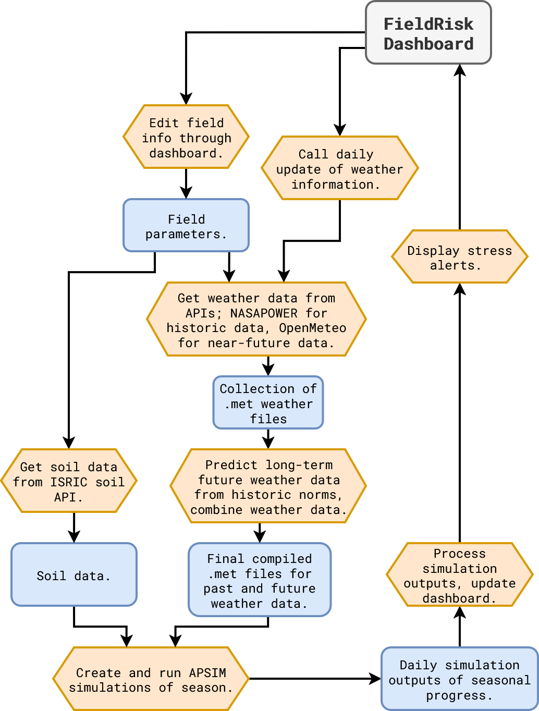

# Precision Digital Agriculture Hackathon 2026 -- Track 4: Analytics & Decision Support

## 1. The Problem

Farmers often detect crop stress too late in the growing season, when yield losses have already occurred. Environmental stressors such as drought, cold freezes, heat stress, nutrient deficiency, and disease risk can develop rapidly and are difficult to monitor consistently across large fields.

Farmers have access to weather forecasts, crop simulation outputs, and satellite imagery, but these data sources are often fragmented and difficult to interpret together. As a result, producers frequently rely on manual scouting or delayed field observations, making it difficult to detect early warning signs and determine when to act. This gap between data availability and practical usability leads to reactive rather than proactive decision making. FieldRisk addresses this challenge by integrating multiple data streams into a unified dashboard that synthesizes information and provides clear, actionable management recommendations.

### Who Is Affected

- Farmers and crop producers managing large acreage
- Agronomists/ Extension personnel
- Farm managers who make operational decisions

### What Decisions?

When to irrigate, when to scout for stress, which maturity group to plant, and when weather conditions require interventions.

### Why It Matters

Early detection of stress can enable timely management actions that protect crop yield and reduce unnecessary input costs.

If stress conditions are detected earlier, farmers can:

- Apply irrigation at the optimal time
- Adjust fertilizer applications
- Prioritize scouting in high risk areas
- Intervene quickly to control pests or diseases

Failure to detect stress early can lead to:

- Reduced yields
- Higher input application costs
- Inefficient resource allocation

## 2. Solution Overview

### Data Acquisition / Decision / Action Outputs

- Historical Weather Data from the NASA Power API
- Short-term Weather Forecase from the OpenMeteo API
- Soil data from ISRIC World Soils API
- Custom Weighted Sum-based long-term weather prediction
- Apsim Simulations for simulated crop stress and environmental covariates.

### Outputs

- Clear prediction of crop stress throughout the year.
- Easy comparison of environmental conditions to crop stress.
- All data is paired withe the predicted crop phenology so the farmer knows what to look for in the field.
- During the time before planting, planting date recommendations are provided based on weather data if no estimated planting date is provided.

### Decision Support

- Shows upcoming high-stress periods.
- Helps farmers understand when their crop is doing well and they can save resources.
- Provides action recommendations based on the environmental conditions the plant will actually experience, not just weather conditions.
- Updates simulations throughout the year based on new data to maintain short-term accuracy, and improve long-term predictions.

### Actions

- When to Irrigate
- When to Increase Monitoring
- When to plant, and which maturity is recommended
- When no action is needed for peace of mind

## Technical Approach

> The dashboard is built in **Streamlit** with **Plotly** visualizations.

### Baselines & Our Approach

#### APSIM

Our project is built on APSIM for prediction and environmental covariate estimation. Our environmental covariates are a relatively new approach compared to most APSIM projects. We can improve this by better integrating APSIM (an R package) with our Python-based project.

#### Weather Prediction

We use a weighted sum for weather prediction. This can be improved through modeling tools such as fitting a weighted regression function, or using trained meteorological ML models, though few exist with the long-term rage we require.

#### Action Recommmendations

Similar projects rely on LLM prediction for recommendations, but often do so with insufficient input data for accurate or non-generic recommendations. Our recommendations are basic for now, not utilizing an LLM, but a future improvement to incorporate LLM recommendation generation can be much more accurate due to the simulated data than recommendations without that foundation.

#### Docker

While many applications are built locally and difficult to share or iterate, the Field Risk Dashboard is built with Docker from the ground up for easy sharing and development, regardless of the local machine.

#### NDVI Integration

We iterated designs for using NDVI Satellite data to corroborate current stress indices and help with understanding spatial heterogeneity of stress, but while we were able to generate some graphs based on example data, we were not able to complete this strech goal in the project time frame.


> Our NDVI Integration Prototype (Did not make current Dashboard prototype).

### Data Sources

| Source | Description | Sites |
| -------- | ------------- | ------- |
| Sentinel-2 via Google Earth Engine | NDVI at 10m resolution, 2022 growing season | IAH1-4 |
| Open-Meteo API | 16-day weather forecast (temp, rain, radiation) | IAH1-4 |
| G2F 2022 Phenotypic Data | Field metadata (planting date, maturity, coordinates) | IAH1-4 |
| APSIM/SCE Simulation | Soybean trial outputs (26 maturity groups, daily growth, stress, yield) | IAH5 |
| NASA POWER / ERA5 | Historical weather for APSIM .met files | IAH1-4 |

All data is public. No private keys are required.

### Preprocessing Pipeline



> Flowchart of business logic and interactibility

## Run Instructions

### Quick Start (Docker, localhost)

1. Install Docker Locally: [Guide](https://docs.docker.com/engine/install/)
2. Clone repo into a local folder:

    ```bash
    git clone https://github.com/gabishop88/FieldRisk.git
    ```

3. Use `docker-compose` to create the container:

    ```bash
    docker compose up --build
    ```

    > **Tip**: Use `-d` to make the docker container start in the background instead of using the current terminal

4. Then open `http://localhost:8501` in your browser.

### Judge Mode

No external API keys are required. All data is bundled in the repository:

The dashboard runs entirely offline from cached `.csv` and `.met` files.

## Constraints and Limitations

We were unable to get APSIM to function inside of a Docker container. This won't take too long to fix, but prevents the prototype version from having real-time simulation updates, insetad showing the simulated data for the example input only.

Once APSIM functions properly, our Planting Date Recommendation feature will also work, but is reliant on the simulations.

Right now, we have most of the data accessible through the Graphical Interface, but there are no options to download the data for additional review. This would be a simple feature that adds a lot, and would likely be one of the first additions to this project.

We were not able to completely integrate current real NDVI data with our simulation data to validate simulated stress and show spatial heterogeneity of stress. This is another part of the dashboard that can be prototyped quickly.

We have not integrated LLM recommendations. This would require relatively simple API integration, but was not within the scope of this prototype version.
